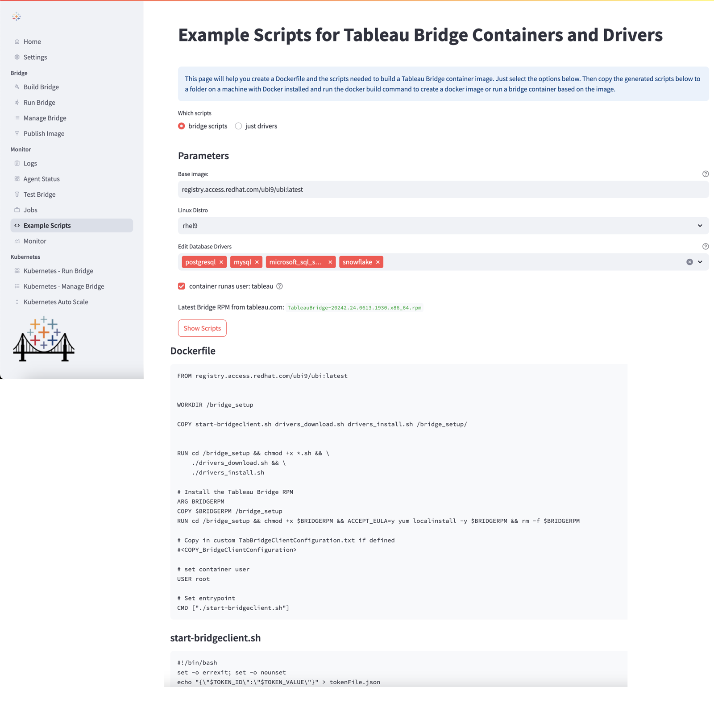

BridgeCTL can show example bash scripts for creating Bridge containers and installing drivers. These are the scripts which BridgeCTL itself uses to generate Bridge container images but you may want to customize for your own environment. This feature is useful if you would prefer to build the bridge docker containers yourself or learn how BridgeCTL builds these containers.

