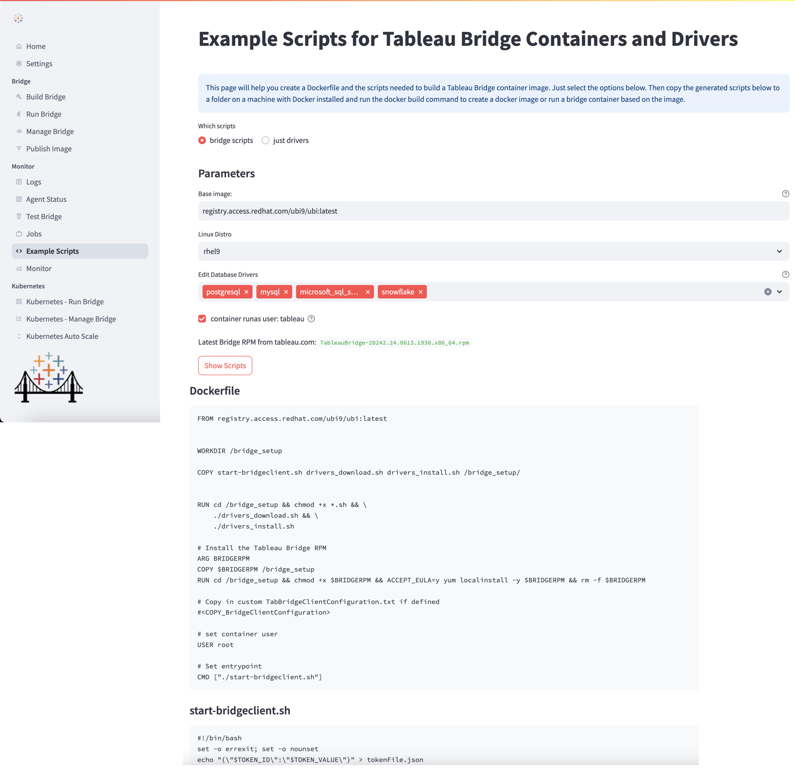

### Quickstart Demo Video

### Terms of Use
This repo contains utilities and source code example files for creating and running Tableau bridge Linux containers. These scripts may be useful but are unsupported. Please get help from other users on the Tableau Community Forums.

### Documentation for Tableau Bridge
See [official Tableau documentation](https://help.tableau.com/current/online/en-us/to_bridge_linux_install.htm) for creating bridge containers on Linux

   
### User interface screenshots
Home

Command-line Interface

__

Build Bridge Container Images

Analyze Logs

Monitor Bridge Agent Health

Autoscale Bridge Pods in Kubernetes

Example Dockerfile Scripts

